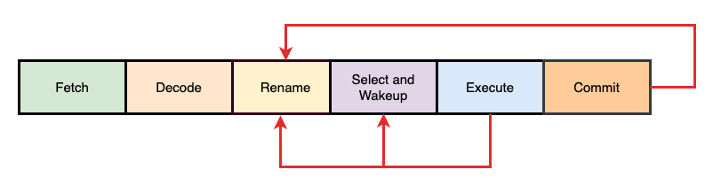
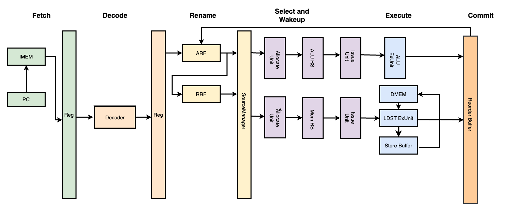

# HeliosXCore 文档

## 介绍
HeliosXCore 是一个单发射乱序执行超标量 RISC-V 处理器，HeliosXCore 切分了六集流水线，分别为取指、译码、重命名/派发、选择唤醒、执行、提交写回。


## 整体架构





## 流水线架构
- [Fetch]()
- [Decode]()
- [Dispatch/Rename]()
- [Select and WakeUp](HeliosXCore/sw.md)
- [Execute](HeliosXCore/ex.md)
- [Commit]()

## 差分测试框架
在本项目中我们实现了 [HeliosXSimulator](https://github.com/HeliosXCore/HeliosXSimulator) 以及 [HeliosXEmulator](https://github.com/HeliosXCore/HeliosXEmulator) 用于实现了一个简单的差分测试框架。

差分测试的概念来源于香山，原理是通过比对 RTL 仿真执行的结果与软件模拟器运行的结果来判断 RTL 实现是否正确。具体的执行流程为：
- 处理器仿真产生指令提交
- 模拟器执行相同的指令
- 比较两者的状态

使用 verilator + difftest 框架可以极大地加快仿真速度以及验证 RTL 代码功能正确性。

在我们实现的差分测试框架中， simulator 通过在 RTL 引出几个 debug 信号（debug_pc, debug_wen, debug_reg_id, debug_wreg_data）并在同一周期在模拟器中执行与处理器提交的指令数相同的代码数来进行比对并验证正确性。

HeliosXSimulator 运行的核心逻辑如下：

```cpp
            while (!Verilated::gotFinish() && sim_time >= 0 && running) {
                reset_dut();
                if ((sim_time % clock) == 0) {
                    tick();
                }
                cpu_top->eval();

                if ((sim_time % (2 * clock)) == 0) {
                    input();
                    // 信号连线
                    connect_wire();
                    // 检查是否很长时间没有进行提交并结束仿真
                    detect_commit_timeout();
                    // Trace 判断 Dut 运行是否正确
                    trace();
                }

                m_trace->dump(sim_time);
                sim_time++;
            }
```

其中 HeliosXSimulator 通过是否提交指令的信号进入验证逻辑，并执行模拟器指令并验证结果：

```cpp
if (trace_on() && (debug_commit_en)) {
                DifftestResult result;
                emulator->exec(1, &result);
                ref_pc = result.pc;
                ref_wen = result.wen;
                ref_wreg_num = result.reg_id;
                ref_wreg_data = result.reg_val;
                if (ref_pc != debug_pc_o || ref_wen != debug_wen ||
                    ref_wreg_num != debug_wreg_num ||
                    ref_wreg_data != debug_wreg_data) {
                    ......
                    running = false;
                }
```

## 测试与验证
