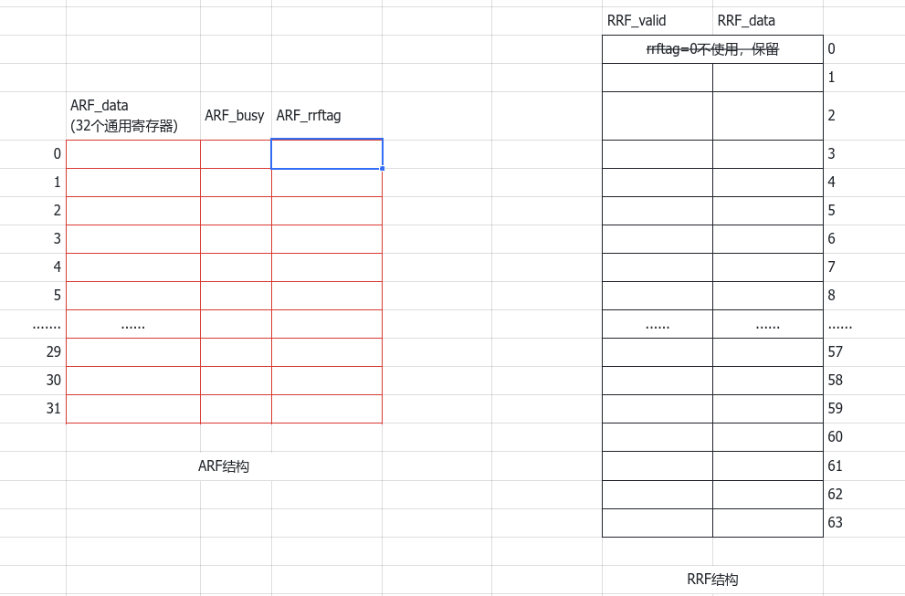

# 1. DP整体模块分析

DP模块的核心部件有：arf , rrf , reservation request gen , rrf entry allocate , src operand manager , syncRAM。

> arf、rrf、rrf entry allocate 三者共同构成了HeliosXCore 重命名机制，也即对Tomasulo算法的实现。



**arf和rrf模块：**

首先arf接受指令的译码信号，根据接受到的源操作数读取通用寄存器的值，如果arf.busy=0，说明当前通用寄存器的值可用，直接读取即可；通用寄存器的当前值不可用，也即arf.busy=1,就去查RRF重命名表中的data域,如果rrf.valid=1，说明可用，就用rrf.data,如果rrf.valid=0，说明不可用，就将当前寄存器对应的arf.rrftag传给保留站。

此外，rrf模块还会接受来之执行部件的前递结果。当指令在执行部件执行完以后，会将执行的结果以rrftag为索引写回rrf.data和保留站中，这个过程也称为前递。rrf在接受到执行部件前递回来的数据以后，会将对应的rrf.valid置为1,表明此时rrf.data可用。

当指令提交的时候，会传给arf和rrf一个提交使能信号，rrf在接受到该信号以后， 会将rrf.datta中的值传送到arf.data中。arf在接受到提交使能信号以后，会接受来自rrf.data的数据，并将arf.busy置为0。

**这里有两个特殊情况，分别对应于rrf接受前递的结果以及arf接受来自ROB部件的提交结果，下面分别说明：**
1. rrf模块接受前递的结果
rrf模块需要维护的主要就是rrf表。当执行部件执行完以后，会将执行结果前递给rrf.data,并且将对应的rrf.valid置为1。但是当指令在执行部件执行完毕，开始将执行结果前递给DP阶段的rrf模块的时候，如果某条刚好需要这个前递结果作为源操作数的指令开始进入DP阶段，那么实际上这条指令会错过执行部件前递回来的数据，并且后面也不会再有机会获取到这个数据。为此，为rrf模块增加了一个bypass（旁路）。
具体设计如下：
```verilog
    // 如果在读rrf.data的时候，如果当前rrf.valid为0,且需要的结果刚好前递回来，这时应当选择这个前递回
    // 来的结果，所以这里需要加一个bypass,用来选择一下
    wire forward_accessible_1;
    assign forward_accessible_1 = ( forward_rrf_we_alu1_i | forward_rrf_we_alu2_i | forward_rrf_we_ldst_i | forward_rrf_we_mul_i | forward_rrf_we_branch_i ) ?
    ((rs1_rrftag_i==forward_rrftag_alu1_i)
    |(rs1_rrftag_i==forward_rrftag_alu2_i)
    |(rs1_rrftag_i==forward_rrftag_ldst_i)
    |(rs1_rrftag_i==forward_rrftag_mul_i)
    |(rs1_rrftag_i==forward_rrftag_branch_i))
    :0;
    wire forward_accessible_2;
    assign forward_accessible_2 =( forward_rrf_we_alu1_i | forward_rrf_we_alu2_i | forward_rrf_we_ldst_i | forward_rrf_we_mul_i | forward_rrf_we_branch_i ) ?
    ((rs2_rrftag_i==forward_rrftag_alu1_i)
    |(rs2_rrftag_i==forward_rrftag_alu2_i)
    |(rs2_rrftag_i==forward_rrftag_ldst_i)
    |(rs2_rrftag_i==forward_rrftag_mul_i)
    |(rs2_rrftag_i==forward_rrftag_branch_i))
    :0;

    wire rs1_rrfvalid;
    wire rs2_rrfvalid;
    assign rs1_rrfvalid = rrf_valid[rs1_rrftag_i];
    assign rs2_rrfvalid = rrf_valid[rs2_rrftag_i];

    // 读rrf
    // 读rrf.data
    // 当当前rrf.data可用时，直接读取当前的rrf.data;如果当前rrf.data不可用，需要看看前递结果是否可用，如果前递结果可用，就用前递结果；
    assign rs1_rrfdata_o  = ( ~rs1_rrfvalid & forward_accessible_1 ) ?
    (
      (rs1_rrftag_i==forward_rrftag_alu1_i)?forward_rrfdata_alu1_i:
      (rs1_rrftag_i==forward_rrftag_alu2_i)?forward_rrfdata_alu2_i:
      (rs1_rrftag_i==forward_rrftag_ldst_i)?forward_rrfdata_ldst_i:
      (rs1_rrftag_i==forward_rrftag_mul_i)?forward_rrfdata_mul_i:
      forward_rrfdata_branch_i
    )
    : rrf_data[rs1_rrftag_i];

    assign rs2_rrfdata_o  = ( ~rs2_rrfvalid& forward_accessible_2 ) ?
    (
      (rs2_rrftag_i==forward_rrftag_alu1_i)?forward_rrfdata_alu1_i:
      (rs2_rrftag_i==forward_rrftag_alu2_i)?forward_rrfdata_alu2_i:
      (rs2_rrftag_i==forward_rrftag_ldst_i)?forward_rrfdata_ldst_i:
      (rs2_rrftag_i==forward_rrftag_mul_i)?forward_rrfdata_mul_i:
      forward_rrfdata_branch_i
    )
    : rrf_data[rs2_rrftag_i];

    // 读rrf.valid
    assign rs1_rrfvalid_o = (~rs1_rrfvalid & forward_accessible_1) ? 1 : rrf_valid[rs1_rrftag_i];
    assign rs2_rrfvalid_o = (~rs2_rrfvalid & forward_accessible_2) ? 1 : rrf_valid[rs2_rrftag_i];

```
2. arf接受来自ROB部件的提交结果
ROB部件选择出可以提交的指令以后，会传给DP阶段的arf和rrf模块一个提交使能信号，然后arf模块接受到提交使能信号以后，会将对应的arf.busy置为0,表明该通用寄存器的值已经可用了。但是如果此时一条新的指令的目的寄存器和提交的寄存器相同，那么该寄存器的arf.busy应当置为1,而不是0。所以也需要增加一个判断，代码如下：
```verilog
    // clear arf busy
    always @(posedge clk_i) begin
        if (reset_i) begin
            arf_busy <= 0;
        end else if (completed_we_i) begin
            if(completed_dst_rrftag_i == {arf_rrftag5[completed_dst_num_i],arf_rrftag4[completed_dst_num_i],arf_rrftag3[completed_dst_num_i],arf_rrftag2[completed_dst_num_i],arf_rrftag1[completed_dst_num_i],arf_rrftag0[completed_dst_num_i]}) begin
                arf_busy[completed_dst_num_i] <= 1'b0;
            end
        end
    end
```

**然后是对reservation request gen模块的分析。**

reservation request gen模块用来产生对保留站的请求信号，主要是根据译码阶段传来的指令需要的保留站的类型，向保留站输出需要的保留站选择信号。HeliosXCore有四种保留站，所以会输出四种选择信号。

**src operand manager模块：**

该模块用来综合选择从arf和rrf模块中读取到的数据，并将选择出来的源操作数的值传递给保留站。该模块输出的源操作数有以下几种可能：
1. arf.data可用，该模块输出的是寄存器的值
2. rrf.data可用，该模块输出的是寄存器的值
3. arf.data和rrf.data都不可用，该模块输出的是源寄存器对应的rrftag

**下面对重命名的过程进行更进一步的分析：**

首先，dp从id模块接受译码信号，主要包括两个源寄存器编号、目的寄存器编号。
对于译码阶段送来的rs/rd寄存器号分别进行分析：
对于rs寄存器。rs信号会被送到arf这个部件中。在arf部件的内部有两个模块，构成了arf的三个域。分别是arf.data域：一个四读两写的ram；arf.rrftag和arf.busy：称为重命名表。
通过rs寄存器编号对寄存器的值进行读取，读出的data数据会送到sourceoperand manager模块进行综合选择，确定最终需要送给保留站的源操作数。
通过rs源寄存器号从重命名表中读取arf.rrftag和arf.busy。 通过rs寄存器编号读取到arf.busy 和 arf.rrftag，读出的数据可以送给source operand manager 进行综合判断，确定最终需要送给保留站的源操作数。

读取rs源寄存器对应的数据时，源操作数还可能来自于RRF.data域，所以还需要从RRF结构中读取数据。我们可以根据ARF entry.rrftag找到RRF中对应的entry,进行对rrf.data 和 rrf.valod 进行读取。读出的数据可以送给source operand manager 进行综合判断，确定最终需要送给保留站的源操作数。

首先分析一下arf模块的接口：

```verilog
    // 读源寄存器
    input  wire [ `REG_SEL-1:0] rs1_i,
    input  wire [ `REG_SEL-1:0] rs2_i,
    output wire [`DATA_LEN-1:0] rs1_arf_data_o,
    output wire [`DATA_LEN-1:0] rs2_arf_data_o,
    output wire                 rs1_arf_busy_o,
    output wire                 rs2_arf_busy_o,
    output wire [ `RRF_SEL-1:0] rs1_arf_rrftag_o,
    output wire [ `RRF_SEL-1:0] rs2_arf_rrftag_o,


    // COM阶段提交的指令的源寄存器编号
    // 来自于ROB
    input wire [`REG_SEL-1:0] completed_dst_num_i,
    // 来自于rrf
    input wire [`DATA_LEN-1:0] from_rrfdata_i,
    // 来自于ROB
    input wire [`RRF_SEL-1:0] completed_dst_rrftag_i,
    // 来自于ROB
    input wire completed_we_i,


    // 设置目的寄存器
    input wire [`REG_SEL-1:0] dst_num_setbusy_i,
    input wire [`RRF_SEL-1:0] dst_rrftag_setbusy_i,  //目的逻辑寄存器1，并设置其busy位
    input wire                dst_en_setbusy_i

```

- rs1_1/rs2_1:来自于译码模块,是指令的源寄存器号，这个寄存器编号会用来定位arf entry,用来读取源寄存器的数据
- rs1_arf_data_o：从通用寄存器arf 中读取到的data。会传给SrcOpmanager
- rs1_arf_busy_o：和data 同理。busy 为0说明当前通用寄存器没有被重命名，busy 为1说明被重命名了。当寄存器被重命名，会进一步读取rrf 的rrf.data
- rs1_arf_rrftag_o：寄存器zaibei 重命名以后，会被分配一个rrftag，这个rrftag 是用来索引RRF 重命名表的。在heliosxcore中，RRF 表项一共有63个(64-1，rrftag 为0不使用)
- completed_we_i：提交使能信号，用来确定指令是否可以提交
- from_rrfdata_i：来自于rrf模块。在指令COM之后，需要将rrf.data copy到arf.data中去，这个from_rrfdata_i就是来自于rrf的数据
- completed_dst_num_i：来自于ROB模块。这个是 rrf.data -> arf.data的 arf索引
- completed_dst_rrftag_i：COM提交的指令的目的寄存器对应的rrftag,用来和arf.rrftag进行比对，确认写回的地址正确。

 然后来看输出信号：
- dst_num_setbusy_i:来自于译码模块。这个实际上就是指令的目的寄存器编号，这个编号可以用来更新arf entry的数据域。具体来说，在为指令的目的寄存器分配了rrftag以后，目的寄存器编号对应的arf entry的busy需要置为1。
- dst_en_setbusy_i：来自于译码模块。这个信号实际上就是译码模块输出的 指令是否需要将执行结果回目的寄存器。只有执行结果需要写回目的寄存器的指令才需要分配rrftag并设置busy为1。
- dst_rrftag_setbusy_i：为指令的目的寄存器分配的rrftag，由rrfentryallocate 部件分配，从1开始编码

处理完rs源操作号，接下来处理rd目的寄存器号。
对于rd目的寄存器号，需要为其分配一个空闲的 RRF和ROB 表项，分配表项的功能由rrf entry allocate 模块实现。rd分配到相关的RRF/ROB entry以后，会拥有一个rrftag，这个实际上也是一个索引，可以用来在RRF/ROB结构中查找到相应的entry。分配的rrftag需要写入到以rd寄存器号为索引的ARF entry.rrftag中，这样就建立了ARF entry和RRF entry之间的关联。
- 指令在提交阶段结束后，会释放掉指令中目的寄存器占有的RRF/ROB表项，comnum这个信号就代表了提交的指令的数量。在本例中，由于一个周期最多最多只会有一条指令被提交，所以comnum的取值只可能是0/1。
- 当查找free entry时，需要首先确定上条指令的allocate是否成功，只有上条指令分配成功了，这条指令才能分配，也即，stall_DP需要为0
- 生成的空闲RRF/ROB entry 的rrftag（RRF/ROB共用一个索引，因为RRF和ROB的entry num都是相同的）需要写入到相应的arf.rrftag域，并设置arf.busy为1；需要传给RRF，因为RRF需要更新相应entry的valid位（设置对应的valid为0，表示当前rrf.data不可用）；需要传给ROB，因为ROB需要以分配的rrftag为索引定位相应的ROB entry,然后根据传来的dp使能信号更新entry的相关域
- comnum：来自ROB模块。表示COM阶段提交的指令数量，在单发射中，可能的取值为0,1

在完成对rs 和 rd的处理以后，就可以把从前面各个模块中读取到的数据传给source operand manager进行综合选择，确定最终需要传给保留站的数据了。
- 输入的信号包括来自ARF的arf.busy，arf.data，arf.rrftag、来自RRF的rrf.data,rrf.valid等。
- 综合这些信号之后，确定需要传送给保留站的源操作数src,并且用rdy来指明src中数据的含义：src可能是arf.data、arf.rrftag、rrf.data、0。