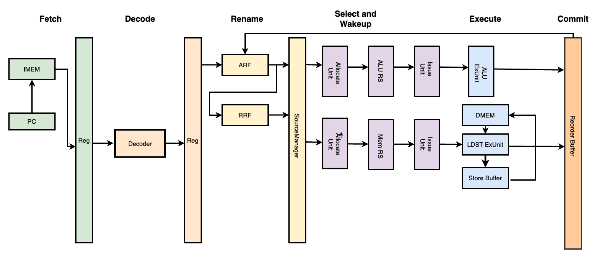

# HeliosXCore 文档

## 介绍
HeliosXCore 是一个单发射乱序执行超标量 RISC-V 处理器，HeliosXCore 切分了六集流水线，分别为取指、译码、重命名/派发、选择唤醒、执行、提交写回。

## 整体架构




## 流水线架构
- [Fetch](HeliosXCore/if.md)
- [Decode](HeliosXCore/id.md)
- [Dispatch/Rename](HeliosXCore/dp.md)
- [Select and WakeUp](HeliosXCore/sw.md)
- [Execute](HeliosXCore/ex.md)
- [Commit](HeliosXCore/com.md)

## 差分测试框架
在本项目中我们实现了 [HeliosXSimulator](https://github.com/HeliosXCore/HeliosXSimulator) 以及 [HeliosXEmulator](https://github.com/HeliosXCore/HeliosXEmulator) 用于实现了一个简单的差分测试框架。

差分测试的概念来源于香山，原理是通过比对 RTL 仿真执行的结果与软件模拟器运行的结果来判断 RTL 实现是否正确。具体的执行流程为：
- 处理器仿真产生指令提交
- 模拟器执行相同的指令
- 比较两者的状态

使用 verilator + difftest 框架可以极大地加快仿真速度以及验证 RTL 代码功能正确性。

在我们实现的差分测试框架中，simulator 通过在 RTL 引出几个 debug 信号（debug_pc, debug_wen, debug_reg_id, debug_wreg_data）并在同一周期在模拟器中执行与处理器提交的指令数相同的代码数来进行比对并验证正确性。

HeliosXSimulator 运行的核心逻辑如下：

```cpp
            while (!Verilated::gotFinish() && sim_time >= 0 && running) {
                reset_dut();
                if ((sim_time % clock) == 0) {
                    tick();
                }
                cpu_top->eval();

                if ((sim_time % (2 * clock)) == 0) {
                    input();
                    // 信号连线
                    connect_wire();
                    // 检查是否很长时间没有进行提交并结束仿真
                    detect_commit_timeout();
                    // Trace 判断 Dut 运行是否正确
                    trace();
                }

                m_trace->dump(sim_time);
                sim_time++;
            }
```

其中 HeliosXSimulator 通过是否提交指令的信号进入验证逻辑，并执行模拟器指令并验证结果：

```cpp
if (trace_on() && (debug_commit_en)) {
                DifftestResult result;
                emulator->exec(1, &result);
                ref_pc = result.pc;
                ref_wen = result.wen;
                ref_wreg_num = result.reg_id;
                ref_wreg_data = result.reg_val;
                if (ref_pc != debug_pc_o || ref_wen != debug_wen ||
                    ref_wreg_num != debug_wreg_num ||
                    ref_wreg_data != debug_wreg_data) {
                    ......
                    running = false;
                }
```

## 测试与验证
HeliosXCore 抛弃了传统的 vivado 的测试验证方法，使用了基于 verilator、gtkwave 等工具的快速仿真方法进行迭代测试。在前期我们基于 verilator 构造了轻量级的仿真测试框架，并基于手动的 C++ 断言进行测试与分析：

```cpp
    virtual void execute() {
        while (sim_time < end_time) {
            reset_dut();
            if ((sim_time % clock) == 0) {
                tick();
            }
            eval();
            if (posedge()) {
                input();
            }
            eval();
#ifndef WAVE
            verify_dut();
#endif
            m_trace->dump(sim_time);
            sim_time++;
        }
    }
```

上述代码是轻量级框架的验证抽象，具体实现在具体类中，例如在 Select and Wakeup 阶段对于 `SwUnit` 进行验证：
```cpp
    void single_alu_inst_issue_input() {
        if (sim_time == 50) {
            dut->reset_i = 0;
            dut->stall_dp_i = 0;
            dut->kill_dp_i = 0;
            disable_next_rrf_cycle();
            // 分配一个 entry
            dut->dp_req_alu_num_i = 1;
            // 发射一条指令
            dispatch(0, OperandType::VALUE, OperandType::VALUE, 1, 2,
                     0x80000000, 0, 1, 1);
        } else if (sim_time == 60) {
            // 在第二个周期，将输入信号修改为 0
            dut->dp_req_alu_num_i = 0;
        }
    }

    // 单指令发射测试
    void single_alu_inst_issue_test() {
        if (sim_time == 60) {
            // 检查分配 entry 编号
            ASSERT(dut->rootp->SwUnit__DOT__alu_allocate_en_1 == 1,
                   "Wrong allocate enable signal!");
            ASSERT(dut->rootp->SwUnit__DOT__free_alu_entry_1 == 1,
                   "Wrong allocate entry singal {}!",
                   dut->rootp->SwUnit__DOT__free_alu_entry_1);

            ASSERT(dut->dp_valid_1_1_i == 1,
                   "Wrong dispatch write valid signal!");
            ASSERT(dut->dp_valid_1_2_i == 1,
                   "Wrong dispatch write valid signal!");

            ASSERT(dut->exe_alu_op_1_o == 1, "Wrong output alu op signal!");
            ASSERT(dut->exe_alu_op_2_o == 2, "Wrong output alu op signal!");
            fmt::println("Single issue test passed!");
        }
    }
    ......
    ......

    void input() override {
        single_alu_inst_issue_input();
        double_alu_inst_issue_input();
        triple_alu_inst_issue_input();
        oldest_alu_inst_issue_input();
        full_alu_inst_issue_input();

        // Load/Store
        single_mem_inst_issue_input();
        double_mem_inst_issue_input();
        single_mem_inst_block_issue_input();
        double_mem_inst_block_issue_input();
        full_mem_inst_issue_input();
    }

    void verify_dut() override {
        single_alu_inst_issue_test();
        double_alu_inst_issue_test();
        triple_alu_inst_issue_test();
        oldest_alu_inst_issue_test();
        full_alu_inst_issue_test();

        // Load/Store
        single_mem_inst_issue_test();
        double_mem_inst_issue_test();
        single_mem_inst_block_issue_test();
        double_mem_inst_block_issue_test();
        full_mem_inst_issue_test();
    }
```

在后期我们首先基于轻量级的 verilator 仿真框架验证基于我们自己构建的内存模拟器(MemSim)进行了基础的测试与时序分析。随后我们将整体流水线接入了自己实现的差分测试框架以及指令模拟器进行差分测试，最终完成了上千条指令的验证通过。

## 其他

除了核心工程外，为了维护整体项目的代码可读性与可维护性，我们花费了很大的精力写了许多脚本，我们对于每一个模块中的每一个硬件部件都写了单测与 Makefile，因此我们可以非常容易地对于任何硬件部件进行迭代实现与 debug。同时我们借助 github CI/CD 集成环境写了很多脚本用于对 verilog 进行 lint 与正确性验证，每次提交 PR 都需要通过 CI，确保了项目的正确性。同时每次 PR 都会经过严格的 code review，确保了项目的可维护性。

本项目经统计有一万余行代码量，其中 verilog 代码 5000 余行，剩下的代码是差分测试框架与大量的测试验证程序与脚本程序，我们构建了一个较为完整的硬件生态可以非常快速地进行项目的持续开发。

## 贡献
- 张仁号：Dispatch/Rename 阶段 RTL 代码编写，搭建指令模拟器框架，搭建流水线，整体流水线测试与 debug，参与测试脚本编写。
- 齐呈祥（队长）：Select/Wakeup 阶段 RTL 代码编写，搭建 verilator 框架，搭建差分测试框架，整理项目维护与 code review，CI 与脚本构建，参与流水线测试。
- 林杰克：Execute 阶段 RTL 代码编写，参与 CI 构建与脚本编写，参与流水线测试。
- 吴虑：Commit 阶段 RTL 代码编写，参与流水线测试与搭建工作。
- 侯姚旸：IF、ID 阶段 RTL 代码编写。

