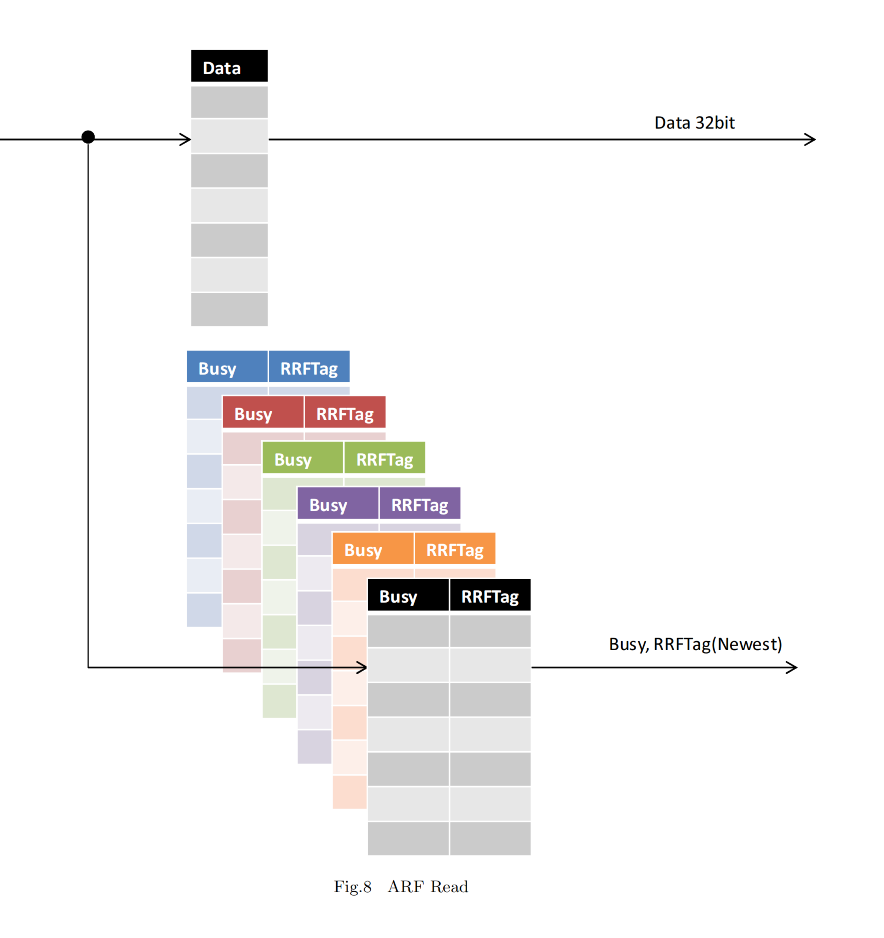
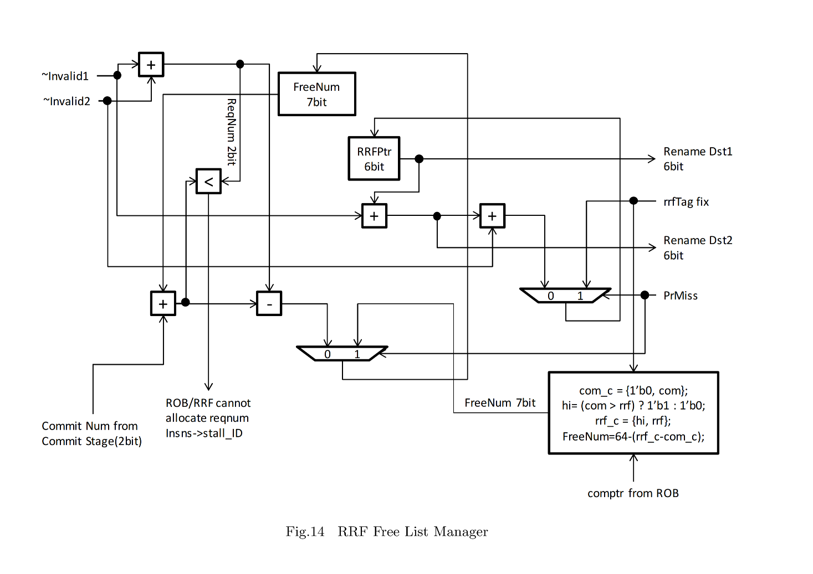
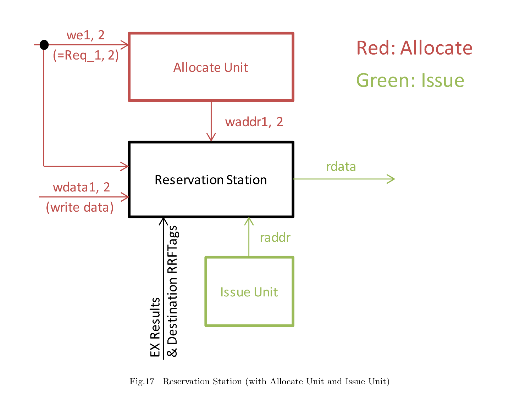
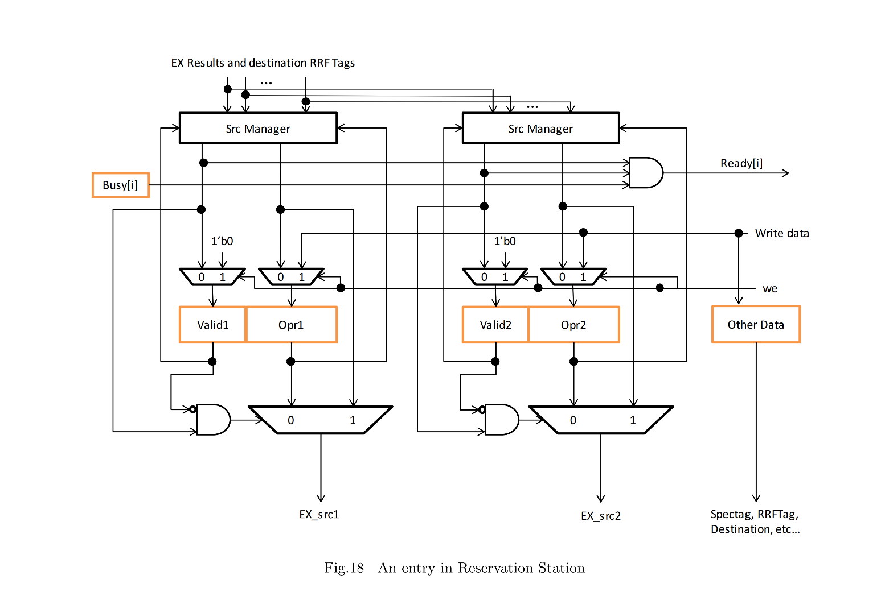
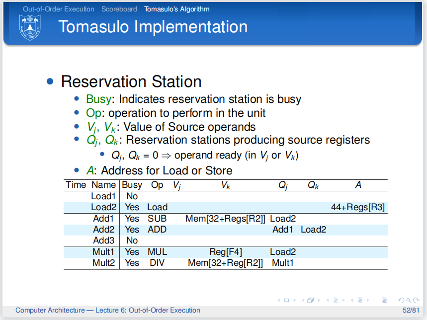
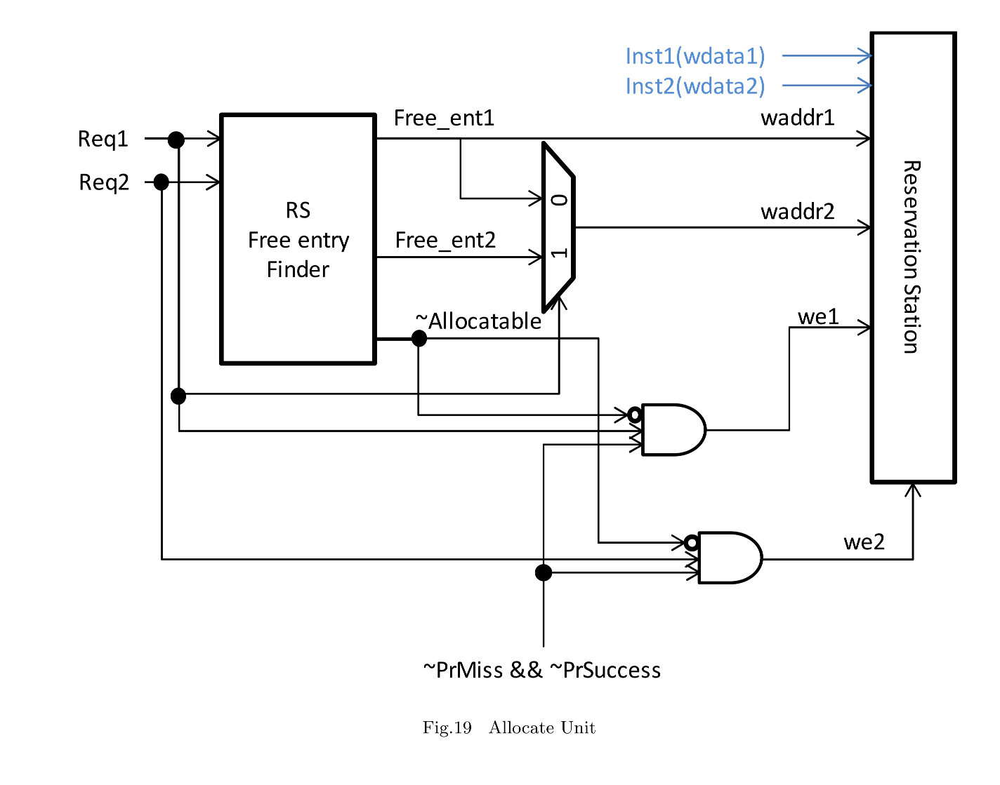
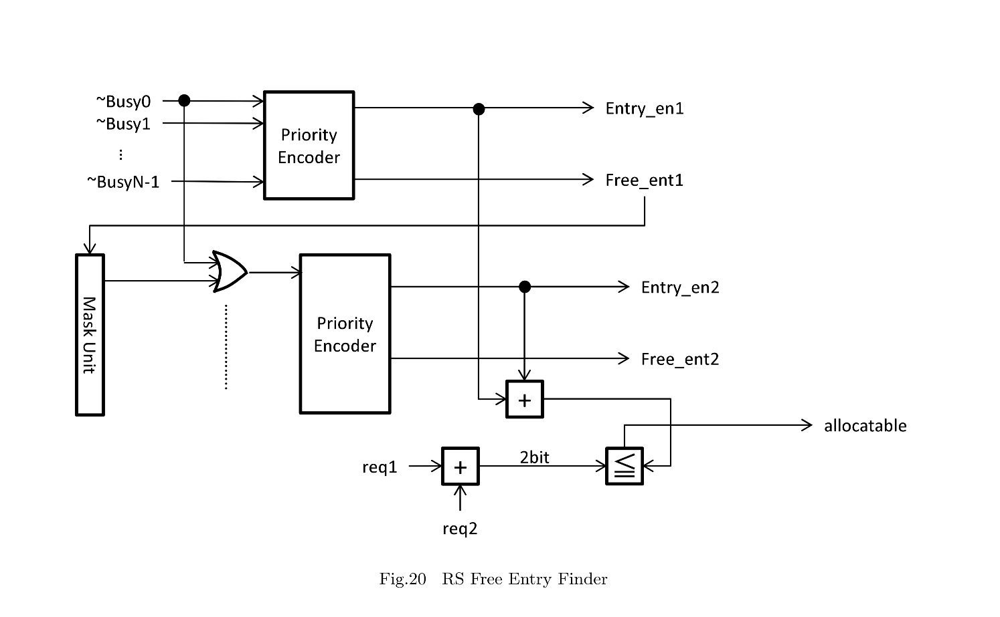
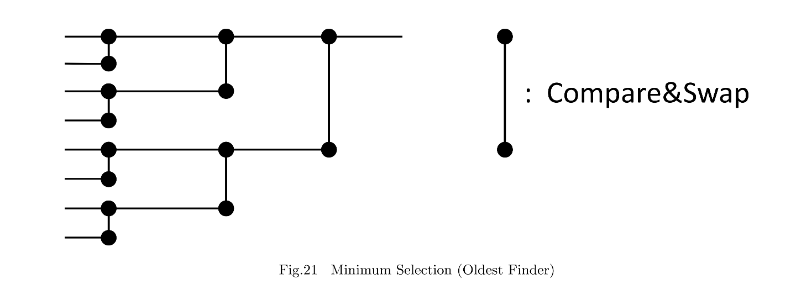
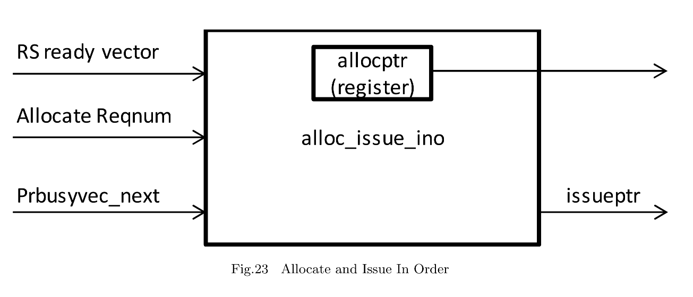

# Ridecore

## Overview

Ridecore 是一个超量表双发射乱序执行 riscv 处理器核，切分成了六级流水线。包含取指、译码、发射、选择与唤醒(Select and Wakeup)、执行和完成。除了在执行阶段的 Load/Store 指令，每个流水线占一个周期。

在取指阶段最多两条指令从 IMEM 中通过 PC 寄存器被取出并且送到下一个阶段。在时钟下降沿读取 IMEM，并且在时钟上升沿写入 IF/ID latch 可以在一个周期内执行完。PC 使用 Gshare 分支预测器进行更新。

译码阶段翻译从取指阶段拿到的指令并且为后面的锁存器生成数据。`Speculative Tag gen` 分发 Speculative Tag 到指令中。如果存在分支指令， `Speculative Tag gen` 和 `Miss Prediction Fix Table` 都将被更新。

发射阶段首先从 `Architected Register File(ARF)` 和 `Rename Register File(RRF)` 中取两条指令的源操作数。接下来执行寄存器重命名通过在 Reorder Buffer 和 RRF 中分配 entries。最终，Allocate Unit 将执行需要的数据写到保留站中。数据转发通过使用 Source Operand Manager 来实现。

在 SW 阶段，Issue Unit 选择那些已经有所有必要的操作数的指令并且发射他们到执行阶段，当一条指令发射后，它被立即从保留站中被移除。

在执行阶段，指令被执行。当指令执行被完成后，结果被写回 RRF。同时，Reorder Buffer 被通知指令完成。Branch Unit 负责决定是否分支预测正确并且将预测结果以适当的方式送法一些模块中。如果分支预测错了，预测执行的指令通过使用 `Miss Prediction Fix Table` 将会无效。除了 Load/Store 指令的执行都被在一周期内执行完，Load/Store Unit 在流水线上两周期执行完。

在完成阶段，在 Reorder Buffer 中最多两条指令被完成。一条指令完成后，在 RRF 中指令的数据被移动到 ARF。在 ARF 中的重命名表被随之更新。分支预测器也被新的信息更新。

## Hardware Modules

### pipe_if

在取指阶段，两条指令被从 IMEM 取出。PC 被分支预测器更新。在 IMEM 中每个 entry 大小是 128 bit，每个 entry 可以包含四条 32-bit 的 RISC-V 的指令。

在每个周期的下降沿，pipe_if 使用 PC[31:4] 从 IMEM 中取四条指令。sellog(Select logic) 从这四条指令中选择两条指令然后把它们写到 IF/ID 锁存器在时钟上升沿。

### decoder

Decoder 是一个在译码阶段被使用的模块。这个模块从发送的指令并为了下个阶段(DP, EX)生成数据。

### ARF

ARF 中的每个 entry 由一个在完成阶段更新的寄存器（Data）以及一些重命名信息(RRFTag, Busy) 组成。Renaming Table 包含重命名信息。当分支预测错误发生，它必须在预测前被恢复。因此，重命名表的数量和 speculative tags 的数量一样多。



### RRF

Renamed Register File(RRF) 中的一个 entry 有两个 attributes: RRFData 和 RRFValid。RRFData 包含这个重命名寄存器的值，RRFValid 决定了是否这个 entry 是有效的。RRF 的 size 是 64-entry 大小，与 Reorder Buffer 一样。实际上，RRF 与 Reorder Buffer 是一一映射的关系，用于访问 RRF 的 tag 也被用于访问 Reorder Buffer。

### sourceoperand_manager

`sourceoperand_manager` 从请求的寄存器编号、ARF 和 RRF 的信息以及 inst1 的 RRFTag 生成要写入预约站（RS）的数据。

### rrf_freelistmanager

rrf_freelistmanager 用于管理 RRF 中的 free 的 entries 和 Reorder Buffer。有两个寄存器，分别是 `FreeNum` 和 `RRFPtr`。`FreeNum` 存储空闲的 entries 的数量。`RRFPtr` 是当前 RRF 和保留站的 entry number。



电路分配 RRFTag 到指令的映射在发射阶段。当 `FreeNum` 比指令请求写入保留站的数量小时，取指阶段和译码阶段都要被暂停因为没有需要被派发的指令了。当指令在完成阶段完成后，被指令使用的 RRFTags 被释放掉，同时 `FreeNum` 也被增加。当分支预测错误发生时，哪些所有预测的指令也会被释放。为了实现这一点，`RRFPtr` 被设置为rrfTag fix，它是导致分支预测错误的分支指令的下一条指令的 `RRFTag`。`FreeNum` 也通过使用rrfTag fix和来自重排序缓冲区的comptr进行恢复。

### src_manager

这个模块是为了转发在发射阶段的结果以及等待在保留站中需要的操作数。

- `opr`：在发射阶段的操作数(被从 `sourceoperand_manager` 送到保留站)。如果 `opr_rdy` 等于 0，opr 包含所需要数据的 RRFTage，否则包含所需要的数据。

- `opr_rdy`：决定 opr 里存储的是什么。

- `exrslt*`, `exdst*`, `kill_spec*`：来自五个执行单元的输出(ALU 1/2, Load/Store Unit, Branch unit, multipiler)。当 `exdsti` 等于 `opr` 并且 `opr_rdy` 和 `~kill_spec*` 都等于 0 时，src 被设置为 `exrslti`。

- `src`, `resolved`：用来转发opr和opr rdy信号的，只要有可能，它们会将这些信号转发到对应的输出端口。

```verilog
module src_manager
  (
   input wire [`DATA_LEN-1:0]  opr,
   input wire 		       opr_rdy,
   input wire [`DATA_LEN-1:0]  exrslt1,
   input wire [`RRF_SEL-1:0]   exdst1,
   input wire 		       kill_spec1,
   input wire [`DATA_LEN-1:0]  exrslt2,
   input wire [`RRF_SEL-1:0]   exdst2,
   input wire 		       kill_spec2,
   input wire [`DATA_LEN-1:0]  exrslt3,
   input wire [`RRF_SEL-1:0]   exdst3,
   input wire 		       kill_spec3,
   input wire [`DATA_LEN-1:0]  exrslt4,
   input wire [`RRF_SEL-1:0]   exdst4,
   input wire 		       kill_spec4,
   input wire [`DATA_LEN-1:0]  exrslt5,
   input wire [`RRF_SEL-1:0]   exdst5,
   input wire 		       kill_spec5,
   output wire [`DATA_LEN-1:0] src,
   output wire 		       resolved
   );

   assign src = opr_rdy ? opr :
		~kill_spec1 & (exdst1 == opr) ? exrslt1 :
		~kill_spec2 & (exdst2 == opr) ? exrslt2 :
		~kill_spec3 & (exdst3 == opr) ? exrslt3 :
		~kill_spec4 & (exdst4 == opr) ? exrslt4 :
		~kill_spec5 & (exdst5 == opr) ? exrslt5 : opr;

   assign resolved = opr_rdy |
		     (~kill_spec1 & (exdst1 == opr)) |
		     (~kill_spec2 & (exdst2 == opr)) |
		     (~kill_spec3 & (exdst3 == opr)) |
		     (~kill_spec4 & (exdst4 == opr)) |
		     (~kill_spec5 & (exdst5 == opr));
   
endmodule // src_manager
```

### imm_gen, brimm_gen

在 RISC-V 中，一些指令在它们的操作数中包含立即数。`imm_gem` 和 `brimm_gem` 生成 32-bit 有符号立即数从 decoded data(imm_type) 和指令数据中。`brimm_gen` 被用于分支指令 `imm_gen` 被用于其他。

### rs_requestgenerator

保留站接受两条指令中的数据和两个写使能信号。

### reservation station(rs_*)

保留站被用于得到和存储寄存器指令的操作数。对于每个执行单元都有一个保留站。Allocate Unit 分配指令到保留站中。Issue Unit 从保留站中发射指令到执行单元。当 Allocate Unit 接收到写使能信号(we1/2)时，它在保留站中寻找 free entries并且生成 write address(waddr1/2)。当在保留站中有一条指令被准备好执行并且相应的执行单元在下一周期不是 busy 的。Issue Unit 将这条指令发射到 Execution Unit。Issue Unit 生成指令的 entry number(raddr) 和保留站输出数据(rdata)到执行单元。Issue Unit 生成指令的 entry number(raddr)，之后保留站输出 data(rdata) 执行单元。







Figure 18 中展示了在保留站中一个 entry 的电路，橙色的方形表示寄存器。`Write data` 是需要执行寄存器指令的数据(operands, opcode, RRFTag, etc.)执行结果被通过 **Src Managers** 转发到 Opr1 和 Opr2 两个寄存器中。

**ALU Reserved Station Entry:**

```verilog

```

### Allocate Unit and Issue Unit

#### Out-of-Order Issue

Figure 19 展示了 Allocate Unit 的电路图。Figure 20 展示了在 Allocte Unit 中使用的 RS Free Entry Finder 的电路图。





分配单元的行为类似于保留站的地址解析器。首先，分配单元接收到对保留站的写请求(Req1/2)。然后，这个单元寻找 free entries 在保留站中使用 **RS Free Entry Finder** 并且将指令数据写到发现了的 free entries(Free_ent1/2)。保留站的接口和四端口内存相同（两个读端口和两个写端口）wdata1/2 ,waddr1/2 , we1/2 是写数据，写地址和写使能信号。


`RS Free Entry Finder` 使用两个优先编码器来寻找最多两个 free entry。第一个优先编码器的输入是来自预约站的繁忙向量的取反（~Busy0-~BusyN-1）。为了避免选择已被第一个优先编码器选择的空闲条目，第二个优先编码器的输入由掩码单元掩盖。Entry en1/2 确定Free ent1/2 是否有效。当Entry en1 + Entry en2 不小于 Req1 + Req2 时，allocatable 变为1。

Issue Unit 选择一条拥有所有必要指令的操作数并且发射到 EX 阶段。当一条指令被发射后，它被立刻从保留站中移除。我们选择 Oldest First algorithm 去选择一条指令发射。



**allocateunit:**

```verilog
module allocateunit  #(
		       parameter REQ_LEN = 4,
		       parameter GRANT_LEN = 2
		       )
   (
    input wire [REQ_LEN-1:0] 	busy,
    output wire 		en1,
    output wire 		en2,
    output wire [GRANT_LEN-1:0] free_ent1,
    output wire [GRANT_LEN-1:0] free_ent2,
    input wire [1:0] 		reqnum,
    output wire 		allocatable
   );
   
   wire [REQ_LEN-1:0] 	       busy_msk;
   
   prioenc #(REQ_LEN, GRANT_LEN) p1
     (
      .in(busy),
      .out(free_ent1),
      .en(en1)
      );

   maskunit #(REQ_LEN, GRANT_LEN) msku
     (
      .mask(free_ent1),
      .in(busy),
      .out(busy_msk)
      );
   
   prioenc #(REQ_LEN, GRANT_LEN) p2
     (
      .in(busy | busy_msk),
      .out(free_ent2),
      .en(en2)
      );

   assign allocatable = (reqnum > ({1'b0,en1}+{1'b0,en2})) ? 1'b0 : 1'b1;
endmodule
```

### In-Order Issue



上图展示了 `alloc_issue_ino` 的电路，它使用保留站作为 FIFO buffer 并实现顺序执行。在电路中仅有一个 `AllocPtr`。`IssuePtr` 指向下一条要被发射的指令，并根据保留站中的 busy vector 和 register AllocPtr 计算出。

### search_begin, search_end

## Verilog Implemenation

### Select and Wakeup

- `src_manager`
  
  `src_manager` 用于管理源操作数的选择和解析
